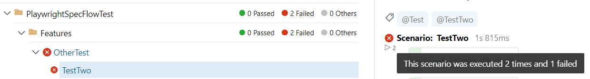

# SpecFlowLivingDocParser

This project was made to solve the issue related to the final status of a test scenario displayed on SpecFlow+ LivingDoc's HTML document when merging multiple test execution files associated with the same logical test run.

## Problem Description

Each SpecFlow test run generates a single test execution file. When re-running tests due to failures, multiple test execution files are generated as a result. When merging these test execution files to generate a single SpecFlow+ LivingDoc's HTML document, a failed status supersedes all other statuses.

This means that if a test scenario failed but passed on re-run, the status of the test scenario would still appear as failed on the document.



## Solution
This program will parse the test execution files (.json) generated by SpecFlow and consolidate the execution results.

 - If the test passed at least once across all the test execution files, the final 
   status will be a pass (OK)
 - If the test did NOT pass at least once across all the test execution files, the final status will either be a fail (TestError) or not run (null).
 - If the test neither passed nor failed due to test error, the final status will be not
   run (null)
 - The status priority is PASS > FAIL > NOT RUN / SKIPPED

## How to Use

Change to the directory the project file is located with:
```sh
cd SpecFlowLivingDocParser
```

Build the project with:
```sh
dotnet build
```

The minimum required parameters include input directory and output directory. The input directory is the directory where your generated test execution files (.json) are located. The output directory is the directory where you want the consolidated test execution file to be created in. The program can be run with:
```sh
dotnet run --inputDir path\to\test\files\directory --outputDir path\to\desired\output\directory
```

There is an optional parameter that can be passed to specify the file name pattern used to locate the test execution files within the specified input directory location. By default, the file pattern the program searches by is "TestExecution*.json"
```sh
--filePattern TestExecution*.json
```
The resulting file will be "TestExecution.json" located in your specified output directory which can be used to generate the SpecFlow+ LivingDoc HTML document.
